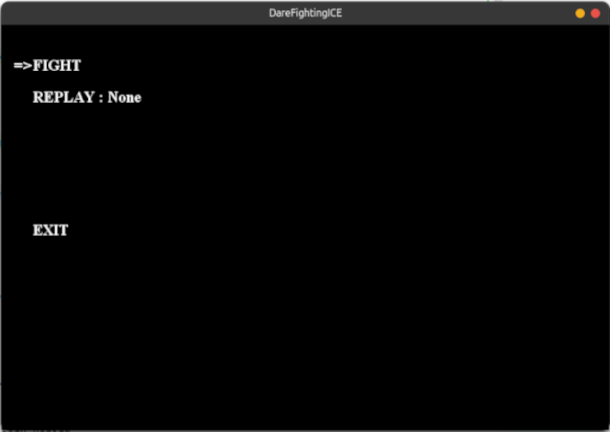
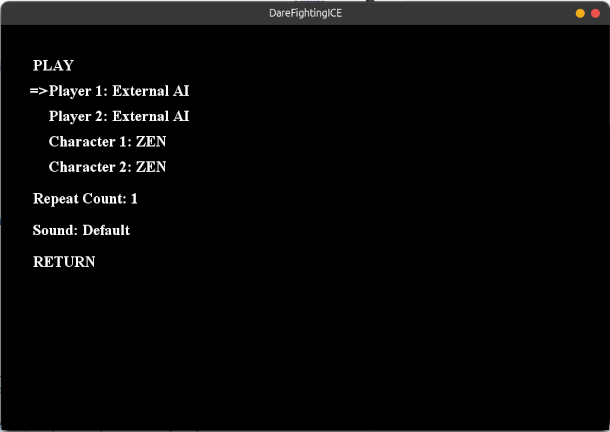
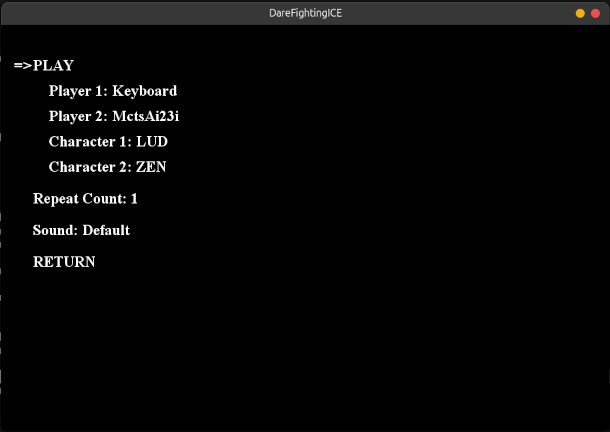
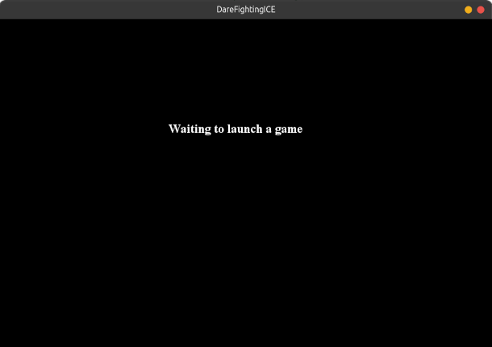
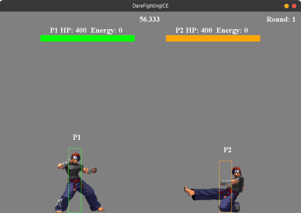

# Artificial Intelligence Fundamentals (AIF) Project


## University of Pisa - First Year, First Semester

### Course Overview

Welcome to the Artificial Intelligence Fundamentals course project! This project is designed to provide hands-on experience with the core concepts and techniques in AI.

### How to try the game

The latest Dare Fighting ICE (v7.0beta) files were downloaded from [here](https://github.com/TeamFightingICE/FightingICE/releases).

To try the game, you can run the following command inside DareFightingICE-7.0beta folder:

Windows
```bash
java -cp FightingICE.jar;./lib/*;./lib/lwjgl/*;./lib/lwjgl/natives/windows/amd64/*;./lib/grpc/*; Main --limithp 400 400 --grey-bg
```

Ubuntu:
```bash
java -cp FightingICE.jar:./lib/*:./lib/lwjgl/*:./lib/lwjgl/natives/linux/amd64/*:./lib/grpc/* Main --limithp 400 400 --grey-bg
```

MacOS:
```bash
java -XstartOnFirstThread -cp FightingICE.jar:./lib/*:./lib/lwjgl/*:./lib/lwjgl/natives/macos/arm64/*:./lib/grpc/* Main --limithp 400 400 --grey-bg
```

Should pop up this window: 



In this game `z` has the same effect as `enter`.
Hit `z` to start the game.

You should see the following screen:



- Move the `up` and `down` arrows to select the menu sub-items.
- Move the `left` and `right` arrows to select the player/character you want to play with.
- In my case, External AI gave null point exception, due to absence of the necessary files.
- I selected for Player 1: Keyboard and Player 2: MctsAi23i (which is a Monte Carlo Tree Search AI, I had already implemented).
- Move back to `PLAY` and hit `z` to start the game.



### Python Integration

Now we need to integrate the Python code with the game. To do this, we need to:

- Create a virtual environment with a specific python version. I use `conda` for this purpose.

```bash
conda create -n AIF python=3.12
```

- Activate the environment

```bash
conda activate AIF
```

- Next, we need to install all the required packages in `requirements.txt` file, which are: 
```python
pyftg==2.3b0
typer~=0.12.2
typing_extensions~=4.8.0
```
with the command:
```bash
pip install -r requirements.txt
```

Now we are all set to integrate the Python code with the game.

### Example of Python Integration

Refer to [this](https://github.com/TeamFightingICE/pyftg/tree/master/examples) repository for more information.

In the `example` folder, We have:

- `DisplayInfo.py` which is an example of AI that utilizes screen data as input.
- `KickAI.py` which is an example of AI that utilize a single command.
- `Main_PyAIvsPyAI.py` which is an example of AI vs AI game setting. Both implementation are in Python.

```python
async def start_process(
    host: str, port: int, character: str = "ZEN", game_num: int = 1
):
    gateway = Gateway(host, port)
    agent1 = KickAI()
    agent2 = DisplayInfo()
    gateway.register_ai("KickAI", agent1)
    gateway.register_ai("DisplayInfo", agent2)
    await gateway.run_game([character, character], ["KickAI", "DisplayInfo"], game_num)
```

This function, in the `Main_PyAIvsPyAI.py` creates two agents and runs the game. Therefore, if we want to implement our agent, we should follow their structure (e.g. `KickAI.py`)

Now we need to start the game, in one terminal (cmd):
Go to the `DareFightingICE-7.0beta` folder and run:

- Ubuntu:
```bash
java -cp FightingICE.jar:./lib/*:./lib/lwjgl/*:./lib/lwjgl/natives/linux/amd64/*:./lib/grpc/* Main --limithp 400 400 --grey-bg --pyftg-mode
```
- Windows:
```bash
java -cp FightingICE.jar;./lib/*;./lib/lwjgl/*;./lib/lwjgl/natives/windows/amd64/*;./lib/grpc/*; Main --limithp 400 400 --grey-bg --pyftg-mode 
```
- MacOS:
```bash
java -XstartOnFirstThread -cp FightingICE.jar:./lib/*:./lib/lwjgl/*:./lib/lwjgl/natives/macos/arm64/*:./lib/grpc/* Main --limithp 400 400 --grey-bg --pyftg-mode
```

You should see the following screen:



with terminal output:

```bash
Nov 19, 2024 3:57:58 PM manager.InputManager <init>
INFO: Create instance: manager.InputManager
Nov 19, 2024 3:57:58 PM manager.DisplayManager initialize
INFO: Create Window 960x640
Nov 19, 2024 3:57:59 PM manager.GraphicManager <init>
INFO: Create instance: manager.GraphicManager
Nov 19, 2024 3:57:59 PM loader.ResourceLoader <init>
INFO: Create instance: loader.ResourceLoader
Nov 19, 2024 3:57:59 PM core.Game initialize
INFO: Socket server is started, listening on 31415
Nov 19, 2024 3:57:59 PM gamescene.Socket initialize
INFO: Waiting to launch a game
```

which means the game is ready to start and waits on port `31415` for the python agents indication.

Next, we need to run the python code in another terminal (cmd). In the `example` folder, run:

```bash
python example/Main_PyAIvsPyAI.py --port 31414 --keyboard
```
`keyboard` is used so that we can control one of the agent with the keyboard. The other will be controlled by the code  in `DisplayInfo.py`.

You should see the following screen:


### Project Objectives

- **Understand** the basics of AI and state-of-the-art algorithms.
- **Implement** simple AI algorithms.
- **Analyze** the performance of different AI algorithms.
- **Collaborate** with peers to solve complex problems.

### Project Structure

### Project Title: **DareFightingICE AI Agent Development**

### Project Overview:
The goal of this project is to develop an AI agent capable of competing in the game **DareFightingICE**, a 1v1 fighting game where agents can utilize sound, video, and statistical inputs such as health points (HP), time, and damage. Unlike previous iterations of the competition that primarily focused on Reinforcement Learning (RL), this project will apply a diverse set of AI methods drawn from the **AIF course syllabus**. These techniques will include **search algorithms**, **logical reasoning**, **constraint satisfaction**, **automated planning**, **multi-agent decision making**, and **probabilistic reasoning**.

### Excluded Methods:
We will exclude **Reinforcement Learning** methods and instead emphasize alternative AI strategies like **adversarial search**, **first-order logic**, and **probabilistic reasoning**, making the project more aligned with classical AI techniques studied during the course.

---

### Project Structure:

#### 1. **Project Setup**
   - **Tools & Languages**: The project will use **Python** for AI agent development and **Java** for the game environment. The code will be based on the official DareFightingICE **repository**.
   - **Game Integration**: Integrate the game environment to allow the AI agent to interact with real-time game inputs such as sound, HP, and damage. Use both sound input data and other visual or statistical data for decision-making.
   - **Agent Control**: Develop functions to control the agent's movements, attacks, and defensive actions using strategic AI methods.

#### 2. **Search Algorithms and Adversarial Search**
   - **Adversarial Search**: Since DareFightingICE is a 1v1 game, we will implement **Minimax** and **Alpha-Beta Pruning** algorithms for the agent’s decision-making in adversarial settings. This will enable the agent to calculate the optimal moves while minimizing the opponent's success.
   - **Search in Complex Environments**: Apply **A* search** and other pathfinding algorithms to handle more complex movements and decisions, such as finding the shortest path to evade attacks or close the distance for offensive maneuvers.

#### 3. **Constraint Satisfaction Problems (CSP)**
   - **CSP Implementation**: The agent will face constraints such as limited time, available health, and possible damage. Implement **constraint satisfaction problems** to manage these limitations and optimize the agent's decision-making in real-time scenarios.
   - **Example**: Create constraints where the agent must balance attacking while conserving health and time, ensuring it doesn't run out of HP or miss critical timing windows in the game.

#### 4. **Logical Agents and First-Order Logic**
   - **Logical Reasoning**: Implement a **logical agent** using **first-order logic** to interpret game states and make intelligent decisions. For example, the agent could deduce when to switch from offense to defense based on available health points and opponent behavior.
   - **Inference Systems**: Use **inference** to predict the opponent’s actions based on their movement patterns, giving the agent an edge in planning its next move.

#### 5. **Automated Planning**
   - **Action Sequences**: The agent will need to plan sequences of actions (e.g., punch, kick, block) in advance. Use **automated planning** techniques to design the best sequence of moves given the opponent’s position and current HP.
   - **Real-Time Planning**: The game environment is dynamic, so the agent will continuously update its plans based on changing inputs such as remaining health and game time.

#### 6. **Probabilistic Reasoning and Uncertainty Management**
   - **Handling Uncertainty**: The agent will rely on **probabilistic reasoning** to handle uncertainty, especially when relying on sound inputs or incomplete visual information. For example, if the opponent’s position is uncertain, the agent will use probabilities to decide whether to engage or defend.
   - **Bayesian Networks**: Implement **Bayesian reasoning** to allow the agent to make informed decisions based on the likelihood of future events, such as predicting the opponent’s next move based on historical behavior.

#### 7. **Multi-Agent Decision Making**
   - **Opponent Modeling**: Develop strategies for **multi-agent decision making**, focusing on how the AI agent interacts with the bot agent or an opponent in the game. The AI will adapt to the opponent’s behavior and dynamically update its strategy using decision-making models.
   - **Dynamic Adjustment**: The agent will continuously adapt its strategy based on observed actions of the opponent, ensuring it remains competitive in the evolving game environment.

#### 8. **Project Presentation & Testing**
   - **Testing & Evaluation**: The AI agent will be rigorously tested against different bots and human players to evaluate performance. Metrics such as win rate, average damage dealt, and time efficiency will be used to refine the agent's decision-making process.
   - **Final Presentation**: Present the completed project during the final **Projects Presentation** session, showcasing the AI agent’s strategy and explaining the applied techniques. Emphasis will be placed on explaining how various AI methods were integrated into the final agent.

---


### Conclusion:
This project will create an AI agent capable of performing in the 1v1 DareFightingICE game environment. The agent will not rely on Reinforcement Learning but instead use classical AI techniques, including **adversarial search**, **constraint satisfaction**, **logical reasoning**, **automated planning**, and **probabilistic reasoning**. Each technique will contribute to a robust and competitive AI capable of dynamic decision-making in a highly adversarial setting.

### Tools and Technologies

- **Programming Languages:** Python
- **Libraries:** To define
- **Platforms:** GitHub

### Evaluation Criteria

- **Code Quality:** Clean, well-documented code.
- **Innovation:** Creative and effective solutions.
- **Collaboration:** Effective teamwork and communication.
- **Presentation:** Clear and concise project presentation.

### Resources

- [Course Syllabus](https://elearning.di.unipi.it/course/view.php?id=1003)
- [Project Guidelines](https://elearning.di.unipi.it/pluginfile.php/84167/mod_resource/content/4/03_projects_proposals.pdf)

---

> "The future belongs to those who learn more skills and combine them in creative ways." - Robert Greene


