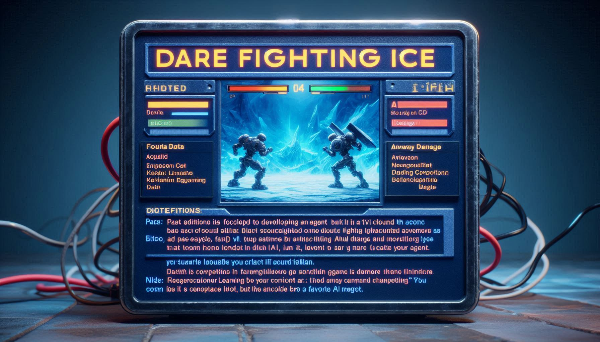

# Artificial Intelligence Fundamentals (AIF) Project

## University of Pisa - First Year, First Semester

### Course Overview

Welcome to the Artificial Intelligence Fundamentals course project! This project is designed to provide hands-on experience with the core concepts and techniques in AI.

### Project Objectives

- **Understand** the basics of AI and state-of-the-art algorithms.
- **Implement** simple AI algorithms.
- **Analyze** the performance of different AI algorithms.
- **Collaborate** with peers to solve complex problems.

### Project Structure

To define ...

### Tools and Technologies

- **Programming Languages:** Python
- **Libraries:** To define
- **Platforms:** Jupyter Notebook, Google Colab

### Evaluation Criteria

- **Code Quality:** Clean, well-documented code.
- **Innovation:** Creative and effective solutions.
- **Collaboration:** Effective teamwork and communication.
- **Presentation:** Clear and concise project presentation.

### Resources

- [Course Syllabus](https://elearning.di.unipi.it/course/view.php?id=1003)
- [Project Guidelines](https://elearning.di.unipi.it/pluginfile.php/84167/mod_resource/content/4/03_projects_proposals.pdf)

---

> "The future belongs to those who learn more skills and combine them in creative ways." - Robert Greene

